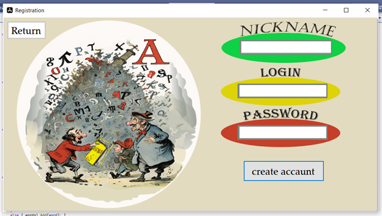
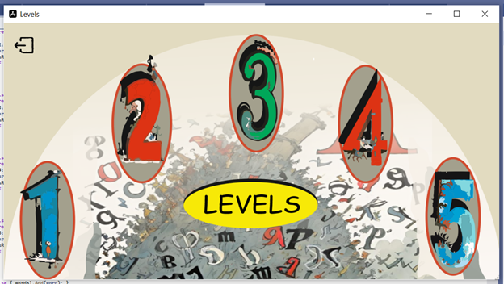
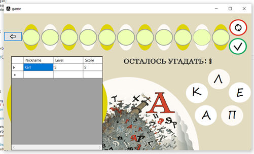

# Десктопное прилолежние для игры в слова

## 🎨 Как это работает
1. **Выбираете уровень**

2. **Выбираете уровень**

3. **Находите все возможные слова в уровне**

4. **Получаете удовольствие**

## ⚙️ Техническая сторона
- **Язык**: C#
- **Хранение данных**: MsSql

## 🚀 Быстрый старт
1. Установите приложение
2. Зарегистрируйтесь
3. Играйте

